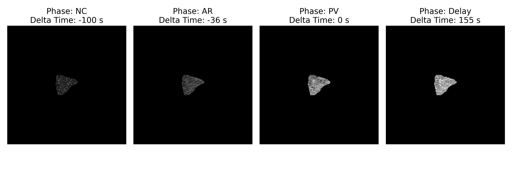
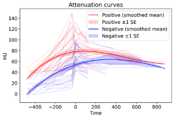
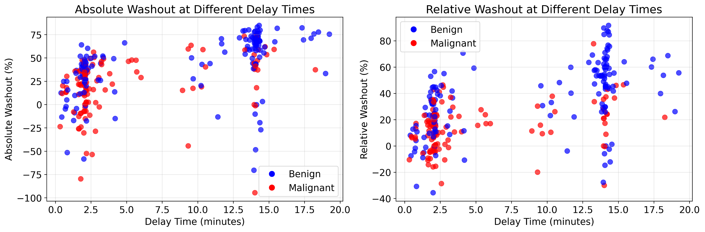
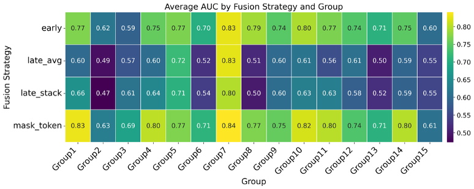

# Real-World Adrenal Lesion Classification with Data Imputation and Multiphase CT Feature Fusion
Code for multiphase CT-based adrenal lesion malignancy classification using radiomic features and multiple feature-fusion strategies, including early fusion, late fusion, and mask-token transformer fusion. The repository contains data preprocessing, feature grouping, oversampling, model training, fusion experiments, and figure-generation notebooks.

Adrenal lesion characterization from CT often relies on multiple imaging phases, such as non-contrast (NC), arterial (AR), portal venous (PV), and delayed (Delay) scans. This repository studies how to classify benign versus malignant adrenal lesions under heterogeneous real-world phase availability, including incomplete phase combinations. The code supports:
1. radiomic feature-based classification across different phase combinations
2. data oversampling for underrepresented phase groups
3. evaluation of washout and washout-rate features
4. comparison of multiple fusion strategies
5. group-wise and overall performance analysis
6. notebooks for reproducing figures and feature-importance analyses.
## Gallery
Attenuation for belign and malignant cases.


Washout features distribution by delay time.


Model performance under different feature fusion strategies.


## Installation
Create a Python environment and install the packages required by the scripts and notebooks. Based on the repository files, the code uses Python packages including:
``` bash
conda create -n adrenaldiff python=3.10
conda activate adrenaldiff
pip install numpy pandas pillow scikit-learn xgboost torch torchvision jupyter matplotlib seaborn
``` 
## Repository structure
Key files in this repository include:

AdrenalDataStructures.py
Parse the original data and save the data according to MRN and StudyDate.  

AdrenalInstance.py
Extracting Features for each study and each imaging phase. 

group_features.py
Defines CT phases, metadata columns, the 15 phase-availability groups, and feature sets used throughout the project.

DataSetOversampling.py
Utilities for oversampling underrepresented phase groups.

DataSetFeatureFusion.py
Dataset preparation for fusion experiments.

FusionStrategy_run_overall.py
Runs overall comparison of fusion strategies with and without washout features.

FusionStrategy_run_groupwise.py
Evaluates fusion strategies within phase-availability groups.

GroupWise_models_*
Classical machine-learning baselines for original and oversampled datasets.

eval_FeatureImportance.py
Feature-importance analysis.

figure_*.ipynb
Notebooks for reproducing paper figures.

## Dependency Installation
``` bash
pip install pydicom
pip install seaborn, pandas, natsort
pip install torch, torchvision
```
## Quick start
1. Prepare normalized feature CSV. Please refer to AdrenalDataStructures.py and AdrenalInstance.py
2. Create config.py. 
Add a file named config.py in the project root:
DATA_ROOT_DIR = "/absolute/path/to/your/project_root"
3. Run fusion strategy comparison.
To compare fusion strategies across the full dataset:
python FusionStrategy_run_overall.py
This script loads the unified normalized feature table, evaluates fusion strategies using 5-fold grouped cross-validation, and saves overall comparison results to the output directory. It runs experiments both with and without washout features.
4. Run group-wise experiments.
Examples:   
python FusionStrategy_run_groupwise.py  
python FusionStrategy_run_groupwise_with_without_washout.py 
5. Run baseline models. 
Examples:
python GroupWise_models_original_xgb_only.py
python GroupWise_models_oversampled_xgb_only.py
python GroupWise_models_oversampled_multiple_models.py
6. Reproduce figures.
Open the Jupyter notebooks such as:
figure_model_performance.ipynb
figure_fusion_strategy_eval.ipynb
figure_feature_importance_variation.ipynb
figure_washout_eval.ipynb.

7. Check outputs.
The overall fusion script writes results to:
output/fusion_strategy_eval/overall_comparison_results.csv
output/fusion_strategy_eval/overall_comparison_results_no_washout.csv.
Other scripts generate model-evaluation outputs, feature-importance summaries, and figure-ready intermediate files.

### Notes
This repository is designed around feature-level multiphase fusion, not raw-image end-to-end learning alone.

The code explicitly supports missing phase combinations through grouped experiments and mask-based fusion.

Washout and washout-rate features are incorporated and can be included or excluded in comparative experiments.


## Citation
If you use this code, please cite the corresponding paper:
``` bibtex
@article{jiang2026multiphaseadrenaldiff,
  title   = {Real-World Adrenal Lesion Classification with Data Imputation and Multiphase CT Feature Fusion},
  author  = {Jun Jiang and colleagues},
  journal = {<Journal name>},
  year    = {2026},
  volume  = {},
  number  = {},
  pages   = {},
  doi     = {}
}
```


